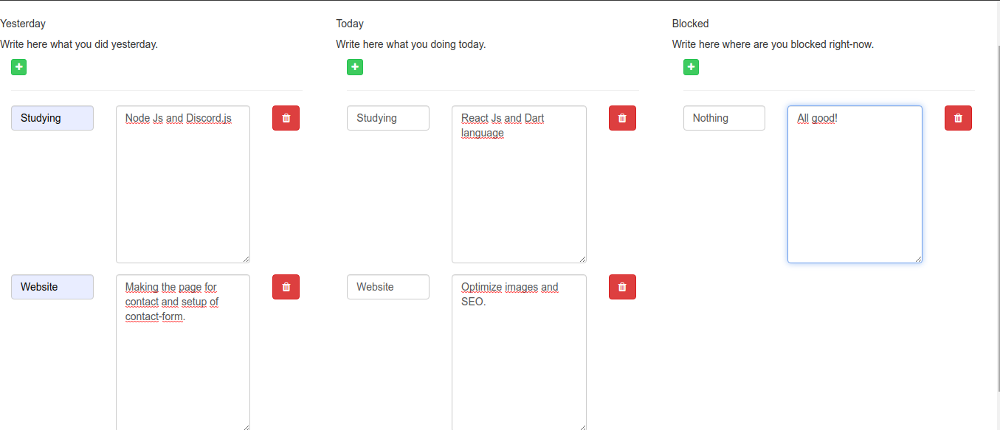
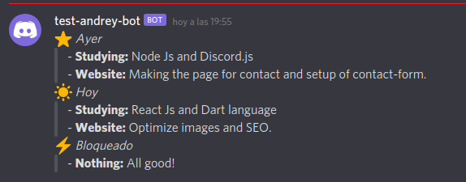

## My First Discord Bot

Made in:

**Backend**
- Node Js (Discord.js, Express, Ejs, Path, Express).

**Front-end**
- Bootstrap 4.
- VueJs.
- Font Awesome 4.7.

---

## Installing

1. Clone the project using a Git client in your computer.
2. Install using the next command in the terminal `npm i`.
3. Run the project using the command `npm run dev`.

## Images:

.
.
